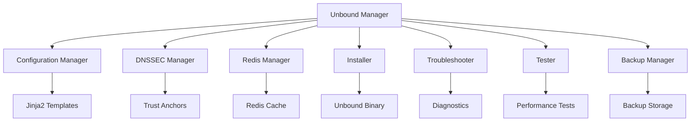

#  Unbound Manager

<div align="center">

[](https://www.python.org/)
[](LICENSE)
[](https://www.linux.org/)
[](https://nlnetlabs.nl/projects/unbound/about/)

### 🚀 **A Modern, Feature-Rich DNS Server Management Tool**

*Transform your DNS infrastructure with an elegant terminal interface and powerful automation*

[Features](#-features) • [Installation](#-installation) • [Usage](#-usage) • [Screenshots](#-screenshots) • [Documentation](#-documentation)

</div>

---

## 🌟 Overview

**Unbound Manager** is a comprehensive Python-based tool that simplifies the deployment, configuration, and management of Unbound DNS servers. With its beautiful terminal UI powered by Rich, it transforms complex DNS operations into intuitive, guided workflows.

### 🎯 Why Unbound Manager?

- **🎨 Beautiful Interface**: Rich terminal UI with colors, tables, and progress indicators
- **🔒 Security First**: Built-in DNSSEC support with automatic key management
- **⚡ High Performance**: Redis caching integration for blazing-fast responses
- **🛠️ Zero Hassle**: Automated installation, configuration, and troubleshooting
- **📊 Real-time Monitoring**: Comprehensive testing and statistics dashboard
- **💾 Safe Operations**: Automatic backups before any configuration changes

---

## ✨ Features

### 🏗️ **Installation & Setup**
- **Automated Compilation** - Downloads and compiles Unbound from source
- **Version Selection** - Choose from the latest stable releases
- **Dependency Management** - Automatic installation of all requirements
- **Smart Configuration** - Intelligent defaults with customization options

### 🔐 **Security Features**
- **DNSSEC Validation** - Full DNSSEC support with automatic trust anchor updates
- **Access Control** - Configurable ACLs for client restrictions
- **Private Address Handling** - Protection against DNS rebinding attacks
- **Control Key Management** - Secure remote control with certificate generation

### 🚄 **Performance Optimization**
- **Redis Integration** - High-performance caching backend
- **Multi-threading** - Automatic CPU core detection and optimization
- **Cache Tuning** - Configurable cache sizes and TTL values
- **Query Prefetching** - Proactive cache refreshing

### 🔧 **Management Tools**
- **Configuration Manager** - Template-based configuration with validation
- **Backup & Restore** - Timestamped backups with easy restoration
- **Service Control** - Start, stop, and restart services from the UI
- **Log Viewer** - Integrated log viewing with syntax highlighting

### 🏥 **Diagnostics & Testing**
- **Health Checks** - Comprehensive system diagnostics
- **DNS Testing** - Test all record types (A, AAAA, MX, TXT, etc.)
- **Performance Benchmarks** - Query performance testing with statistics
- **DNSSEC Validation Tests** - Verify DNSSEC chain of trust
- **Cache Performance** - Test and analyze cache hit rates

### 📈 **Monitoring**
- **Real-time Statistics** - Query counts, cache rates, and response times
- **Redis Metrics** - Cache utilization and performance metrics
- **System Resources** - CPU, memory, and network monitoring
- **Service Status** - Live status of Unbound and Redis services

---

## 📦 Installation

### Prerequisites

- **Operating System**: Ubuntu/Debian-based Linux distribution
- **Python**: Version 3.7 or higher
- **Privileges**: Root or sudo access
- **Network**: Internet connection for downloading packages

### Quick Install

```bash
# Clone the repository
git clone https://github.com/yourusername/unbound-manager.git
cd unbound-manager

# Install the package
sudo pip install -e .

# Run the manager
sudo unbound-manager
```

### Detailed Installation

1. **Clone the Repository**
   ```bash
   git clone https://github.com/yourusername/unbound-manager.git
   cd unbound-manager
   ```

2. **Install System Dependencies** (Optional - the tool will do this automatically)
   ```bash
   sudo apt update
   sudo apt install -y python3-pip python3-venv build-essential
   ```

3. **Install Python Package**
   ```bash
   sudo pip install -e .
   ```

4. **Launch Unbound Manager**
   ```bash
   sudo unbound-manager
   ```

---

## 🎮 Usage

### Main Menu Navigation

When you launch Unbound Manager, you'll see a beautiful terminal interface:

```
╔════════════════════════════════════════════════════════════════╗
║                UNBOUND DNS SERVER MANAGER                      ║
║                     Version 2.0.0                              ║
╚════════════════════════════════════════════════════════════════╝

System Status
┌─────────────────┬──────────┐
│ Service         │  Status  │
├─────────────────┼──────────┤
│ Unbound DNS     │ ● Running│
│ Redis Cache     │ ● Running│
└─────────────────┴──────────┘
```

### 🚀 Quick Start Guide

#### 1️⃣ **Fresh Installation**
```bash
sudo unbound-manager
# Select: 1. Install Unbound (Fresh Installation)
# Follow the guided setup wizard
```

#### 2️⃣ **Configure Redis Caching**
```bash
# From main menu, select:
# 5. Configure Redis Integration
```

#### 3️⃣ **Test Your Setup**
```bash
# From main menu, select:
# 11. Test Unbound Functionality
```

### 📋 Common Tasks

<details>
<summary><b>🔧 Fix Installation Issues</b></summary>

```bash
# From main menu, select:
# 2. Fix Existing Installation
# This will automatically diagnose and fix common problems
```
</details>

<details>
<summary><b>💾 Backup Configuration</b></summary>

```bash
# From main menu, select:
# 7. Backup Configuration
# Backups are stored in /etc/unbound/backups/
```
</details>

<details>
<summary><b>📊 View Statistics</b></summary>

```bash
# From main menu, select:
# 14. View Statistics
# Shows real-time query statistics and cache performance
```
</details>

<details>
<summary><b>🔍 Troubleshoot Issues</b></summary>

```bash
# From main menu, select:
# 10. Troubleshoot Installation
# Runs comprehensive diagnostics
```
</details>

---

## 🖼️ Screenshots

### Main Dashboard
```
┌─ INSTALLATION & SETUP ──────────────────────────┐
│ 1. Install Unbound (Fresh Installation)        │
│ 2. Fix Existing Installation                   │
│ 3. Update Unbound Version                      │
└─────────────────────────────────────────────────┘

┌─ CONFIGURATION ─────────────────────────────────┐
│ 4. Manage Configuration                        │
│ 5. Configure Redis Integration                 │
│ 6. DNSSEC Management                          │
└─────────────────────────────────────────────────┘
```

### Performance Testing
```
┌─ Performance Statistics ────────────────────────┐
│ Metric                      Value              │
├─────────────────────────────────────────────────┤
│ Queries Successful          100/100            │
│ Average Response Time       8.43 ms            │
│ Minimum Response Time       2.11 ms            │
│ Maximum Response Time       45.23 ms           │
│ Cache Hit Rate             87.5%               │
└─────────────────────────────────────────────────┘
Performance Rating: Excellent ✓
```

---

## 📚 Documentation

### Configuration Files

All configuration files are stored in `/etc/unbound/`:

```
/etc/unbound/
├── unbound.conf              # Main configuration
├── unbound.conf.d/           # Modular configurations
│   ├── server.conf          # Server settings
│   ├── control.conf         # Remote control
│   ├── dnssec.conf          # DNSSEC settings
│   ├── redis.conf           # Cache backend
│   └── root-hints.conf      # Root servers
├── root.key                 # DNSSEC trust anchor
├── root.hints               # Root name servers
└── backups/                 # Configuration backups
```

### Architecture



### API Reference

The tool is modular and can be imported as a Python library:

```python
from unbound_manager.installer import UnboundInstaller
from unbound_manager.config_manager import ConfigManager
from unbound_manager.tester import UnboundTester

# Install Unbound programmatically
installer = UnboundInstaller()
installer.install_unbound()

# Run tests
tester = UnboundTester()
tester.run_all_tests()
```

---

## 🤝 Contributing

We welcome contributions! Here's how you can help:

1. **Fork the Repository**
2. **Create a Feature Branch**
   ```bash
   git checkout -b feature/amazing-feature
   ```
3. **Commit Your Changes**
   ```bash
   git commit -m 'Add amazing feature'
   ```
4. **Push to the Branch**
   ```bash
   git push origin feature/amazing-feature
   ```
5. **Open a Pull Request**

### Development Setup

```bash
# Clone your fork
git clone https://github.com/yourusername/unbound-manager.git
cd unbound-manager

# Create virtual environment
python3 -m venv venv
source venv/bin/activate

# Install in development mode
pip install -e .

# Run tests (if available)
python -m pytest
```

---

## 🐛 Troubleshooting

### Common Issues

<details>
<summary><b>❌ "This application must be run as root"</b></summary>

**Solution**: Run with sudo
```bash
sudo unbound-manager
```
</details>

<details>
<summary><b>❌ "Unbound service is not running"</b></summary>

**Solution**: Use the Fix Installation option
```bash
# From main menu, select option 2
# Or manually:
sudo systemctl start unbound
```
</details>

<details>
<summary><b>❌ "Redis connection failed"</b></summary>

**Solution**: Reconfigure Redis integration
```bash
# From main menu, select option 5
# This will fix Redis socket permissions
```
</details>

<details>
<summary><b>❌ "DNSSEC validation failed"</b></summary>

**Solution**: Update trust anchors
```bash
# From main menu: 6 → 2 (Update trust anchor)
```
</details>

### Getting Help

- **📖 Documentation**: Check the [Wiki](https://github.com/yourusername/unbound-manager/wiki)
- **💬 Discussions**: Join our [Discussions](https://github.com/yourusername/unbound-manager/discussions)
- **🐛 Bug Reports**: Open an [Issue](https://github.com/yourusername/unbound-manager/issues)
- **📧 Email**: support@example.com

---

## 📄 License

This project is licensed under the MIT License - see the [LICENSE](LICENSE) file for details.

```
MIT License

Copyright (c) 2024 Your Name

Permission is hereby granted, free of charge, to any person obtaining a copy
of this software and associated documentation files (the "Software"), to deal
in the Software without restriction...
```

---

## 🙏 Acknowledgments

- **[NLnet Labs](https://nlnetlabs.nl/)** - For creating Unbound DNS
- **[Rich](https://github.com/Textualize/rich)** - For the beautiful terminal UI
- **[Redis](https://redis.io/)** - For the high-performance caching backend
- **Community Contributors** - For feedback and improvements

---

## 📈 Project Status


### Roadmap

- [ ] Web UI Dashboard
- [ ] Docker Support
- [ ] Prometheus Metrics Export
- [ ] Multi-server Management
- [ ] Automated Security Updates
- [ ] DNS-over-HTTPS (DoH) Support
- [ ] DNS-over-TLS (DoT) Support
- [ ] Ansible Playbooks

---

<div align="center">

### ⭐ **Star this project if you find it helpful!** ⭐

Made with ❤️ by the Open Source Community

[Back to Top](#-unbound-manager)

</div>
